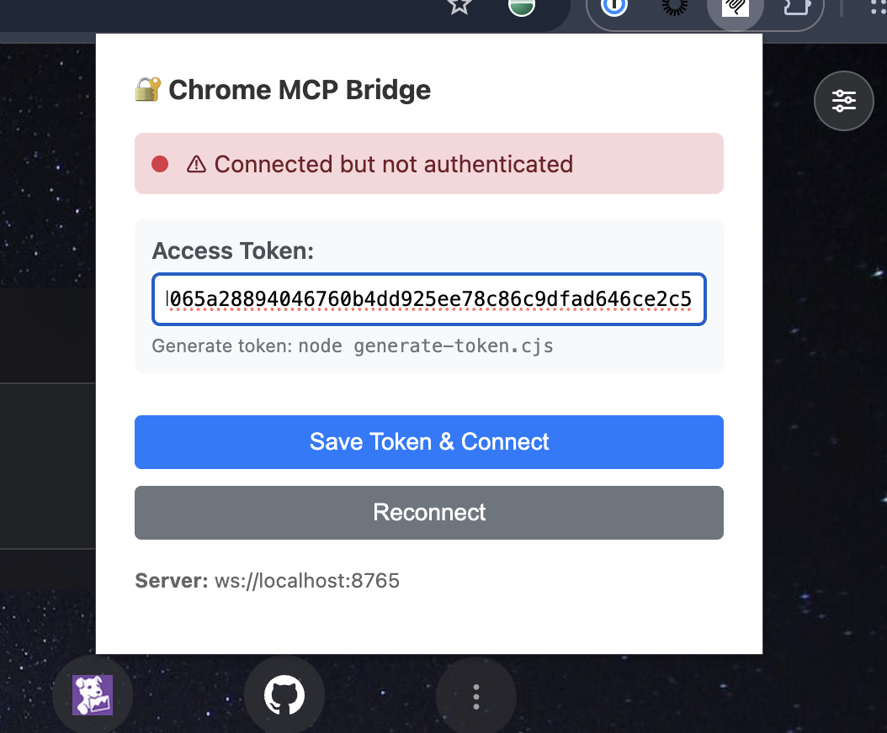
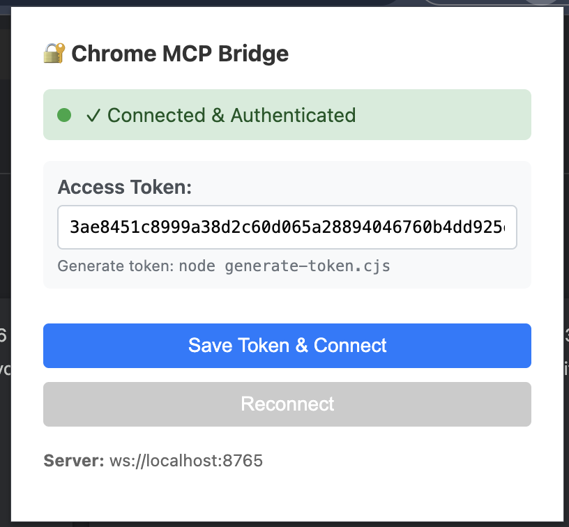
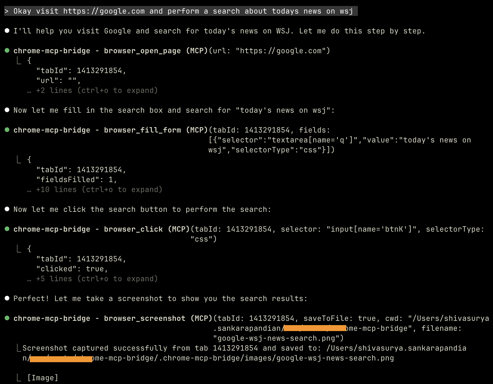

# Chrome MCP Bridge

A **secure** Model Context Protocol (MCP) server that enables Claude Code to control any Chromium-based browser through a Chrome extension bridge with token-based authentication.

## 🔐 Security

This bridge uses token-based authentication to prevent unauthorized access. Only connections with a valid access token can control your browser.

```
┌─────────────┐                    ┌──────────────┐                    ┌─────────────┐
│             │   MCP Protocol     │              │   WebSocket        │             │
│ Claude Code │◄──────────────────►│  MCP Server  │◄──────────────────►│  Extension  │
│             │                    │  (w/ Token)  │   (w/ Token)       │  in Browser │
└─────────────┘                    └──────────────┘                    └─────────────┘
                                          │                                    │
                                          ▼                                    ▼
                                   Token Required                      Token Required
                                   (--token=XXX)                       (Saved in popup)
```

**Protection against:**
- ✅ Malicious websites trying to connect to your WebSocket
- ✅ Unauthorized browser automation attempts
- ✅ Man-in-the-middle attacks (localhost-only)

## Quick Start

### 1. Generate Access Token

First, generate a secure access token:

```bash
node generate-token.cjs
```

This will output a token and configuration instructions. **Save this token** - you'll need it for steps 2 and 3.

### 2. Install Dependencies and Build

```bash
npm install
npm run build
```

### 3. Install the Chrome Extension

Follow these steps to install the extension in your Chrome browser:

#### Step-by-Step Installation:

**Step 1:** Open Chrome browser and navigate to the extensions page:
- Type `chrome://extensions/` in the address bar and press Enter
- Or click the three-dot menu (⋮) → More tools → Extensions

**Step 2:** Enable Developer Mode
- Look for the "Developer mode" toggle in the **top-right corner** of the page
- Click the toggle to turn it **ON** (it should turn blue/enabled)

**Step 3:** Load the Extension
- After enabling Developer mode, you'll see three new buttons appear: "Load unpacked", "Pack extension", and "Load unpacked extension"
- Click the **"Load unpacked"** button

**Step 4:** Select the Extension Directory
- A file browser will open
- Navigate to the location where you cloned this repository
- Select the **`extension/`** folder (not any file inside it, but the folder itself)
- Click "Select Folder" or "Open"

**Step 5:** Configure the Access Token
- Click the Chrome MCP Bridge extension icon in your toolbar
- Paste the **access token** you generated in Step 1 into the "Access Token" field
- Click **"Save Token & Connect"**
- You should see "✓ Connected & Authenticated" when successful

**Before authentication:**


**After successful authentication:**


### 4. Add to Claude Code

You need to manually configure the MCP server in Claude Code's config file:

**Step 1:** Locate your Claude Code configuration file:
- **macOS/Linux**: `~/.config/claude-code/claude_desktop_config.json`
- **Windows**: `%APPDATA%\claude-code\claude_desktop_config.json`

**Step 2:** Edit the configuration file and add the chrome-mcp-bridge entry:

```json
{
  "mcpServers": {
    "chrome-mcp-bridge": {
      "command": "node",
      "args": [
        "/absolute/path/to/chrome-mcp-bridge/dist/index.js",
        "--token=YOUR_TOKEN_HERE"
      ]
    }
  }
}
```

**Important:**
- Replace `/absolute/path/to/chrome-mcp-bridge` with the actual absolute path to this project
- Replace `YOUR_TOKEN_HERE` with the token you generated in Step 1
- If you have other MCP servers configured, add this entry to the existing `mcpServers` object

**Step 3:** Verify configuration:

```bash
claude mcp list
```

You should see `chrome-mcp-bridge` in the list of MCP servers.

### 5. Restart Claude Code

Restart Claude Code for the changes to take effect. The MCP server will now require the token to accept connections.

## Features

- **🔐 Secure**: Token-based authentication prevents unauthorized access
- **Open Pages**: Navigate to URLs in new tabs or windows
- **Close Pages**: Close specific tabs or current tab
- **Screenshots**: Capture visible area or full page screenshots
- **Scroll**: Programmatically scroll pages
- **Find Text**: Search and highlight text in pages
- **Tab Management**: Get current tab info and list all tabs
- **Click Elements**: Click on elements using CSS selectors or XPath
- **Fill Forms**: Fill out multiple form fields at once
- **Get Page Content**: Extract rendered HTML, text, or both with metadata

## How Token Authentication Works

1. **Token Generation**: Run `node generate-token.cjs` to create a cryptographically secure 64-character hex token
2. **MCP Server**: Pass the token via `--token=XXX` argument. Server validates all incoming WebSocket connections
3. **Extension**: Store token in Chrome storage. Send token on every WebSocket connection attempt
4. **Authentication Flow**:
   - Extension connects to WebSocket server
   - Extension sends `{type: "auth", token: "xxx"}` message
   - Server validates token and responds with success/failure
   - Only authenticated connections can send browser commands

**If token validation fails**, the WebSocket connection is immediately closed.

## Architecture

```
Claude Code ←→ MCP Server ←→ WebSocket ←→ Chrome Extension ←→ Browser
```

The system consists of three components:

1. **MCP Server** (`src/index.ts`): Implements the MCP protocol and exposes tools to Claude Code
2. **WebSocket Bridge**: Facilitates real-time communication between server and extension
3. **Chrome Extension** (`extension/`): Executes browser automation commands

## Available Tools

### 1. `browser_open_page`
Open a new page in the browser.

```typescript
{
  "url": "https://example.com",
  "active": true,        // optional, default: true
  "newWindow": false     // optional, default: false
}
```

### 2. `browser_close_page`
Close a browser tab.

```typescript
{
  "tabId": 123  // optional, closes active tab if not provided
}
```

### 3. `browser_screenshot`
Take a screenshot of the current page.

```typescript
{
  "tabId": 123,          // optional, uses active tab if not provided
  "format": "png",       // optional, "png" or "jpeg", default: "png"
  "quality": 90,         // optional, for JPEG only (0-100), default: 90
  "fullPage": false,     // optional, capture full scrollable page, default: false
  "saveToFile": false,   // optional, save to disk, default: false
  "cwd": "/path/to/dir", // required if saveToFile is true
  "filename": "screenshot.png" // optional, auto-generated if not provided
}
```

### 4. `browser_scroll`
Scroll the page to a specific position.

```typescript
{
  "tabId": 123,          // optional, uses active tab if not provided
  "x": 0,                // optional, horizontal position, default: 0
  "y": 500,              // optional, vertical position, default: 0
  "behavior": "smooth"   // optional, "smooth" or "auto", default: "smooth"
}
```

### 5. `browser_find`
Find and highlight text in the page.

```typescript
{
  "tabId": 123,           // optional, uses active tab if not provided
  "text": "search term",
  "highlightAll": false   // optional, default: false
}
```

### 6. `browser_get_current_tab`
Get information about the currently active tab.

```typescript
// No parameters required
```

### 7. `browser_list_tabs`
List all open tabs in the browser.

```typescript
// No parameters required
```

### 8. `browser_click`
Click on an element in the page using a CSS selector or XPath.

```typescript
{
  "tabId": 123,                  // optional, uses active tab if not provided
  "selector": "#submit-button",  // CSS selector or XPath
  "selectorType": "css",         // optional, "css" or "xpath", default: "css"
  "waitForElement": true,        // optional, default: true
  "timeout": 5000                // optional, default: 5000ms
}
```

### 9. `browser_fill_form`
Fill out multiple form fields at once.

```typescript
{
  "tabId": 123,              // optional, uses active tab if not provided
  "fields": [
    {
      "selector": "#username",
      "selectorType": "css", // optional, default: "css"
      "value": "user@example.com",
      "clear": true          // optional, default: true
    },
    {
      "selector": "#password",
      "value": "mypassword"
    }
  ],
  "waitForElements": true,   // optional, default: true
  "timeout": 5000            // optional, default: 5000ms
}
```

### 10. `browser_get_page_content`
Get the rendered page content after it has loaded. Can extract HTML, text, or both, along with metadata.

```typescript
{
  "tabId": 123,              // optional, uses active tab if not provided
  "format": "html",          // optional, "html", "text", or "both", default: "html"
  "includeMetadata": true    // optional, includes page metadata, default: true
}
```

Returns:
- **html**: Full rendered HTML of the page (if format is "html" or "both")
- **text**: Visible text content (if format is "text" or "both")
- **metadata**: Page title, URL, domain, description, Open Graph tags, canonical URL, language, charset
- **tabInfo**: Tab ID, URL, title, status, favicon URL

## Example Usage

> **Tip:** To ensure Claude Code uses the Chrome MCP Bridge tools, mention "chrome mcp bridge" or "using chrome mcp bridge" in your prompts.

Here's a real example of using Chrome MCP Bridge with Claude Code:



```
User: Using chrome mcp bridge, open https://github.com in the browser

Claude: [Uses browser_open_page tool]
I've opened GitHub in your browser.

User: Take a screenshot of the current page with chrome mcp bridge

Claude: [Uses browser_screenshot tool]
Here's a screenshot of the current page: [displays screenshot]

User: Fill in the search box with "machine learning" using chrome mcp bridge

Claude: [Uses browser_fill_form tool]
I've filled in the search box with "machine learning".

User: Click the search button

Claude: [Uses browser_click tool]
I've clicked the search button.

User: Get the page content as text using chrome mcp bridge

Claude: [Uses browser_get_page_content tool with format: "text"]
Here's the text content of the page with metadata:
- Title: Search results for "machine learning"
- Text content: [displays visible text from page]
```

## Development

### Project Structure

```
chrome-mcp-bridge/
├── src/
│   └── index.ts           # MCP server implementation
├── extension/
│   ├── manifest.json      # Extension configuration
│   ├── background.js      # Service worker (WebSocket client)
│   ├── popup.html         # Extension popup UI
│   ├── popup.js           # Popup logic
│   └── icons/             # Extension icons
├── dist/                  # Compiled TypeScript output
├── package.json
├── tsconfig.json
└── README.md
```

## Troubleshooting

### Extension Shows "Not Authenticated"

1. **Check token is saved**: Open extension popup and verify token field has a value
2. **Verify token matches**: Ensure the token in the extension matches the token used in Claude Code MCP config
3. **Regenerate token**: If unsure, run `node generate-token.cjs` to create a new token and update both:
   - Extension popup: Paste new token and click "Save Token & Connect"
   - Claude Code config: Edit `claude_desktop_config.json` and update the `--token=XXX` value in the args array

### Extension Not Connecting

1. Check that the MCP server is running (should start automatically with Claude Code)
2. Verify WebSocket server is listening on port 8765
3. Check extension popup - should show "✓ Connected & Authenticated"
4. Look at browser console: `chrome://extensions/` → Details → "Inspect views: service worker"
5. Check for authentication errors in console logs

### MCP Server Won't Start

If you see `❌ ERROR: No authentication token provided!`:
1. You must provide a token via `--token=XXX` argument
2. Generate one with: `node generate-token.cjs`
3. Add it to your Claude Code config as shown in the output

### Extension Logs

To view extension logs:
1. Go to `chrome://extensions/`
2. Find "Chrome MCP Bridge"
3. Click "Details"
4. Click "Inspect views: service worker"
5. Console will show connection status and errors

### Port Already in Use

If port 8765 is already in use, modify:
- `src/index.ts`: Change `WS_PORT` constant
- `extension/background.js`: Change `WS_SERVER_URL` constant

## Uninstalling

To remove from Claude Code:

1. Edit your Claude Code config file (`~/.config/claude-code/claude_desktop_config.json`)
2. Remove the `chrome-mcp-bridge` entry from the `mcpServers` object
3. Restart Claude Code

## License

MIT

## Contributing

Contributions welcome! Please open an issue or PR on GitHub.
